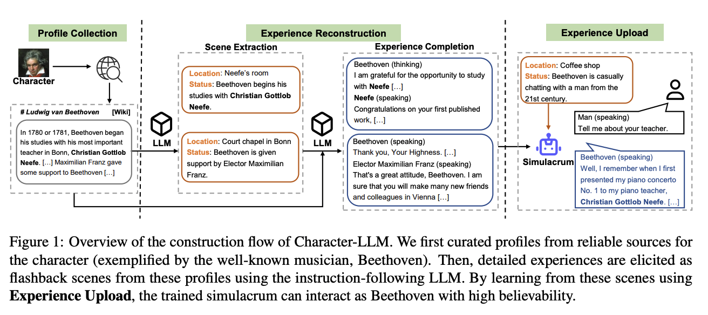

# Character-LLM: A Trainable Agent for Role-Playing

[Paper](/review/pdfs/Character%20LLM.pdf)

- Beethoven, Cleopatra, and Caesar, with personalized profiles, experiences, and emotional states
- New methods
  - Experience reconstruction: extract scenes as memory flashes
  - Protective Experiece: aimed at teaching the model to forget or ignore information not relevant to the character to prevent knowledge hallucinations
  - Experience Upload: where these experiences are fine-tuned on a base LLM model to create a specialized agent for each character
- Key components:
  - **Profile**: A compilation of concise descriptions about the attributes of a character. These descriptions provide a comprehensive introduction of the character’s overall information and significant events, covering a wide range of stages from early childhood to the final period.
  - **Scene**: A particular place where the character’s interaction unfolds. The scene consists of a detailed illustration, including the temporal and spatial context of the interactions, and the characters involved.
  - **Interaction**: The cognitive processes, utterances, or actions of characters. All interactions are represented in plain text.
- They used GPT 3.5 Turbo to extract information
- For each character they on avg. had: 1.6K scenes, 750K words, with 13 turns per scene and 36 words per turn.
- Tested using an interview process: beats ChatGPT using a fine tuned LLaMA 7B model
- For each character: 8xA100 80GB GPUs, 1h. 5 to 10 epochs, manally picked based on interview eval.
