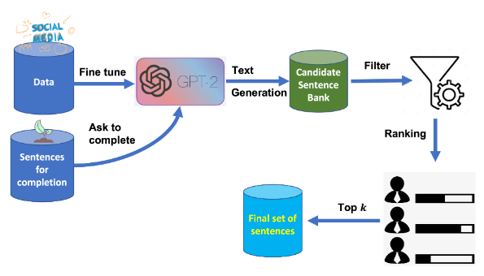

# Article recaps
## Data Augmentation for Modeling Human Personality: The Dexter Machine
- data augmentation approach - PEDANT
  - pretrained GPT
  - domain expertise
  - unlabeled text that GPT reacts to
- two phases
  - unlabeled data pulled from online resources and used to train a generative language model
  - the trained model is prompted to complete a set of sentences crafted by domain expert
- anti-social psychopathic personality (Dexter pipeline)
- improves results in labeling text for these disorders
