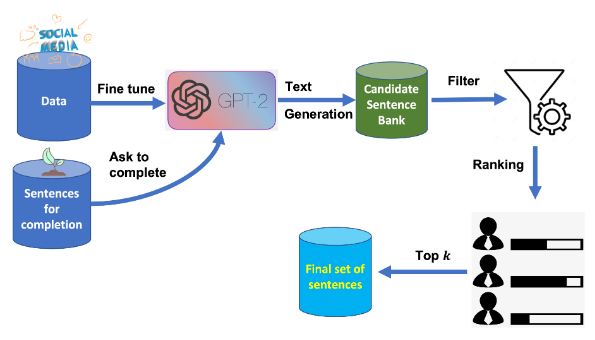

# Article recaps

## Data Augmentation for Modeling Human Personality: The Dexter Machine

The paper describes a novel data augmentation approach named PEDANT that helps train models that mimic human personality by generating large amounts of data with a GPT combined with domain expertise.

The method first gathers unlabeled data from online resources and trains a generative language model with it.
Then, this model is prompted with seed sentences that an expert created and is asked to complete them.
Then, these completions are filtered and ranked based on an expert-defined scoring function.

In the paper, PEDANT was implemented on an anti-social psychopatic personality disorder.
A labeled corpus with this disorder does not exist, so this is a good showcase of the usefulness of the approach.

The data to train the GPT comes from cinema, TV, and Reddit.
The model was validated using a text classification task, as per the standard.
They used the generated data to train a classifier and tested it on offensive-speech datasets.
The results were very encouraging, but requires domain knowledge, which can be a big limiting factor and bottleneck in a larger process.
